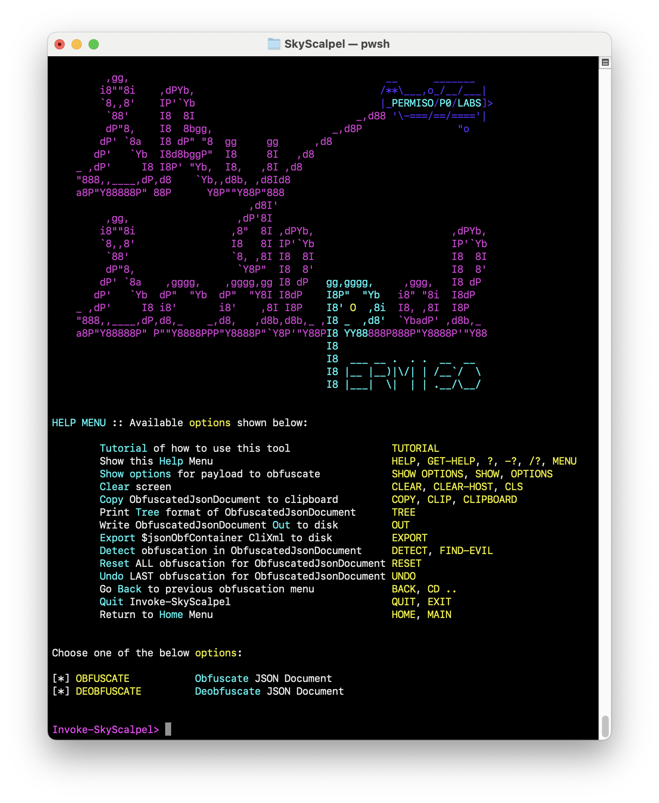
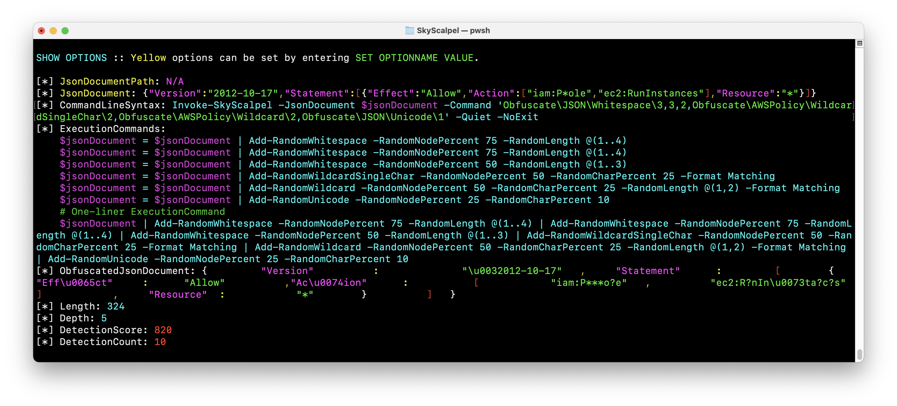
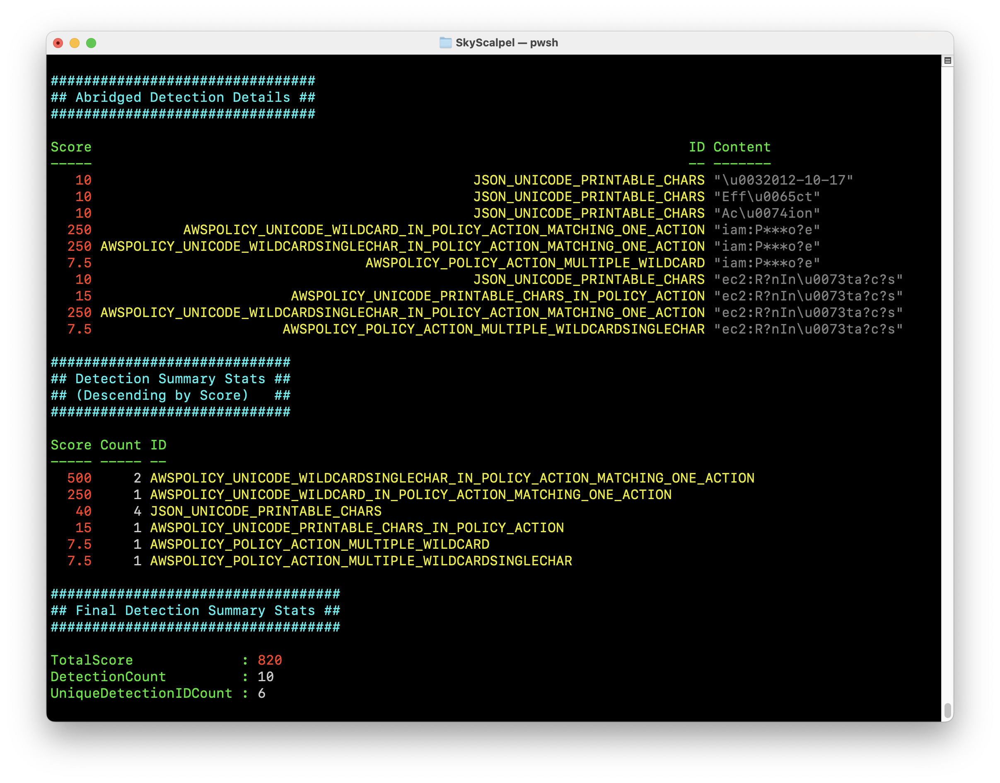
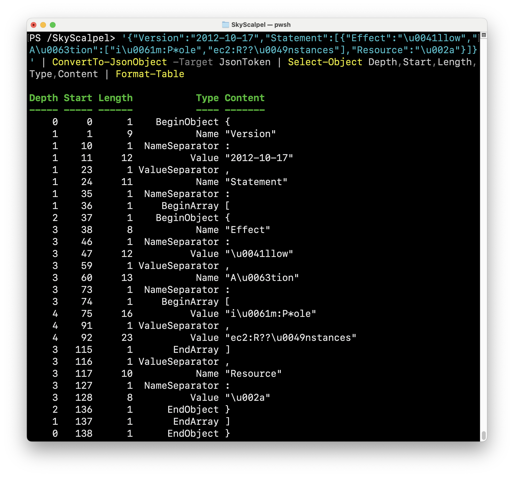
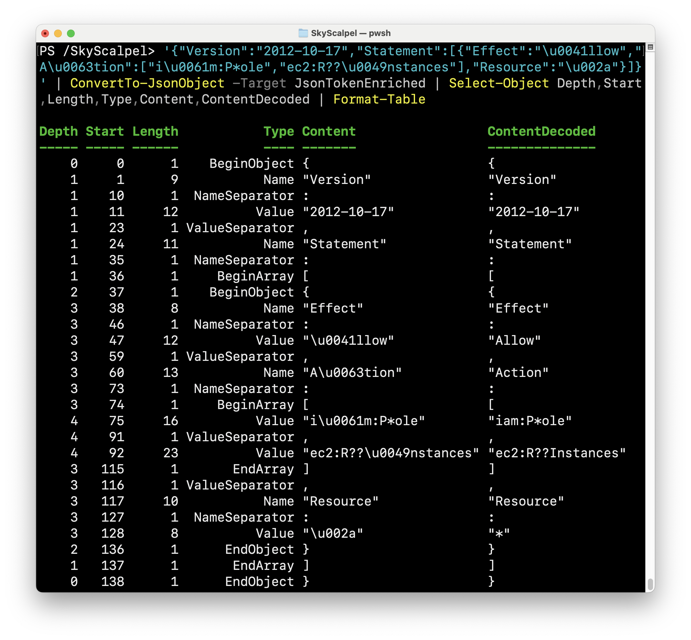
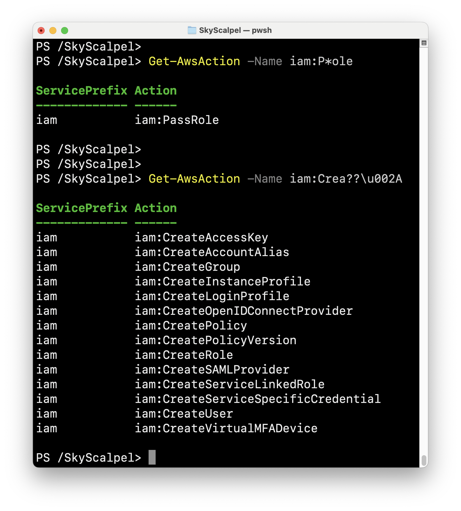



# SkyScalpel

**Permiso:** [https://permiso.io](https://permiso.io/)

**Read our release blog:** https://permiso.io/blog/introducing-sky-scalpel-open-source-tool

**Released At:** <a href="https://www.blackhat.com/sector/2024/briefings/schedule/index.html#skyscalpel-making--breaking-policy-obfuscation-in-the-cloud-41117">Black Hat SecTor 2024</a> (2024-10-24)

**Authors:** <a href="https://twitter.com/danielhbohannon">Daniel Bohannon (DBO)</a> & <a href="https://www.linkedin.com/in/abian-morina/">Abian Morina (Abi)</a>

## Introduction

SkyScalpel is an open-source framework for JSON policy parsing, obfuscation, deobfuscation, and detection in cloud environments. It provides flexible and highly configurable mechanisms to handle JSON-level obfuscation, IAM policy transformations, and the detection of evasive obfuscation techniques in cloud security contexts.

Built on a custom C# JSON tokenizer and syntax tree parser, SkyScalpel offers unique insights into how obfuscated cloud policies (e.g. IAM policies) can evade detection and empowers defenders to surgically detect and neutralize these obfuscation techniques. The framework also integrates a PowerShell wrapper to enhance usability through pipeline capabilities and command chaining.

## Installation

>```PowerShell
>Import-Module ./SkyScalpel.psd1
>```

## Required Packages

>```bash
>PowerShell 7.1
>.NET 6.0 (LTS)
>```

## Usage

Interactive mode is a colorful, menu-driven experience found in the `Invoke-SkyScalpel` function (which also supports non-interactive capabilities via its own built-in CLI). It is designed to promote exploration of all available functions with colored highlighting applied to amplify the important details returned from each function. There is also some special animated ASCII art in this function, so we recommend giving it a whirl first.



Menu exploration supports full regex and basic wildcards, with special automated menu traversal options defined by `**`, `***` and `****` commands. You can always type `HELP` or `TUTORIAL` for more guidance.

At any point the full details of each layer of obfuscation or deobfuscation can be viewed, copied or fully exported out of the interactive menu. SkyScalpel also has full CLI support displayed in the same menu, so interactive mode can be used to "create obfuscation recipes" that can easily be exported into simple 1-liner commands.



The entire detection module is built into the interactive menu as well, at all times displaying the rule count and total detection score. Running `FIND-EVIL` will give a full summary of the detection report evaluated in sheer milliseconds against the current obfuscated JSON document.



## Parser Usage

The `ConvertTo-JsonObject` function is the simplest way to access the various parsing methods defined in `./CSharp/JsonParser.cs`. There are three (3) levels of parsing available and defined via the function's `-Target` input parameter.

The following two commands demonstrate the most directly useful parsing levels:

`'{"Version":"2012-10-17","Statement":[{"Effect":"\u0041llow","A\u0063tion":["i\u0061m:P*ole","ec2:R??\u0049nstances"],"Resource":"\u002a"}]}' | ConvertTo-JsonObject -Target JsonToken | Select-Object Depth,Start,Length,Type,Content | Format-Table`

The underlying C# method can also be called directly: `[SkyScalpel.JsonParser]::Tokenize('{"Version":"2012-10-17","Statement":[{"Effect":"\u0041llow","A\u0063tion":["i\u0061m:P*ole","ec2:R??\u0049nstances"],"Resource":"\u002a"}]}') | Select-Object Depth,Start,Length,Type,Content | Format-Table`



`'{"Version":"2012-10-17","Statement":[{"Effect":"\u0041llow","A\u0063tion":["i\u0061m:P*ole","ec2:R??\u0049nstances"],"Resource":"\u002a"}]}' | ConvertTo-JsonObject -Target JsonTokenEnriched | Select-Object Depth,Start,Length,Type,Content,ContentDecoded | Format-Table`

The underlying C# method can also be called directly: `[SkyScalpel.JsonParser]::ToTokenEnriched('{"Version":"2012-10-17","Statement":[{"Effect":"\u0041llow","A\u0063tion":["i\u0061m:P*ole","ec2:R??\u0049nstances"],"Resource":"\u002a"}]}') | Select-Object Depth,Start,Length,Type,Content,ContentDecoded | Format-Table`



## AWS Action Expansion

To simplify expansion of AWS Action names when wildcards are present, the `Get-AwsAction` function resolves input AWS Action names with all matching Action names.

`Get-AwsAction -Name iam:P*ole`

`Get-AwsAction -Name iam:Crea??\u002A`


